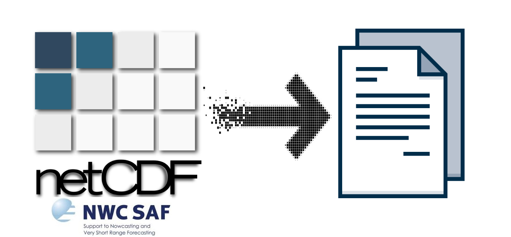

<div align="center">

  
  <h1>NWC-SAFer</h1>
  
  <p>
    An awesome CLI tool simplifying NetCDF data extraction of NWC-SAF products and transformation to different file formats! 
  </p>
  
  
<!-- Badges -->
[](https://github.com/fotioudim/nwc-safer/commits/main)
[](https://github.com/fotioudim/nwc-safer/issues/)
[](https://github.com/fotioudim/nwc-safer/network/members)
[](https://github.com/fotioudim/nwc-safer/stargazers)
[](https://opensource.org/licenses/MIT)

   
<h4>
    <a href="https://github.com/fotioudim/nwc-safer/issues/">Report Bug</a>
  <span> · </span>
    <a href="https://github.com/fotioudim/nwc-safer/issues/">Request Feature</a>
  </h4>
</div>

<br />

<!-- Table of Contents -->
# :notebook_with_decorative_cover: Table of Contents

- [:notebook\_with\_decorative\_cover: Table of Contents](#notebook_with_decorative_cover-table-of-contents)
  - [:star2: About the Project](#star2-about-the-project)
    - [:books: Tech Stack](#books-tech-stack)
  - [:toolbox: Getting Started](#toolbox-getting-started)
    - [:wrench: Prerequisites](#wrench-prerequisites)
    - [:gear: Installation](#gear-installation)
      - [PyPi (recommended)](#pypi-recommended)
      - [Source](#source)
    - [:running: Run Locally](#running-run-locally)
  - [:bookmark\_tabs: Usage](#bookmark_tabs-usage)
    - [Watch directory and convert incoming files](#watch-directory-and-convert-incoming-files)
    - [Single file conversion](#single-file-conversion)
    - [Check compatible products](#check-compatible-products)
    - [Launch Github repository](#launch-github-repository)
  - [:compass: Roadmap](#compass-roadmap)
  - [:warning: License](#warning-license)
  - [:handshake: Contact](#handshake-contact)
  

<!-- About the Project -->
## :star2: About the Project

This is a modern and simplified Command Line Interface tool created to extract info and metadata from NetCDF files and convert them into different file formats such as Csv, Excel, plain text, etc.

Its aim is to simplify data extraction from NWC SAF [products](https://www.nwcsaf.org/web/guest/nwc/geo-geostationary-near-real-time-v2021) and their transformation to different file formats, more readable and easier to access and edit. ΝWC-SAF is an initiative of [EUMETSAT](https://www.eumetsat.int/) to provide operational services ensuring the optimum use of meteorological satellite data in Nowcasting and Very Short Range Forecasting.


<!-- TechStack -->
### :books: Tech Stack

The tech stack of this project consists of the following main technologies/frameworks/tools:
- [](https://www.python.org/)
- [![Typer](https://img.shields.io/badge/typer-white.svg?style=for-the-badge&logo=data:image/png;base64,iVBORw0KGgoAAAANSUhEUgAAACAAAAAaCAYAAADWm14/AAAACXBIWXMAAAsSAAALEgHS3X78AAAAAXNSR0IArs4c6QAAAolJREFUSEvNlk9LalEUxddNxUglkEBQyJETBw4SEdSRjsWBItFM/QLppJFiYk0Fw4kD8QuUiIJIhfSPHEjDQBApEkcSFKUEqY99ouj1vF1vL9/rTO5kn31+e+21z7nceDwe4z8u7kcAkAjX19eoVqu4u7vDLEWZn5+Hw+GAyWSCTCYDU6BWqyEQCDCIf7GUSiU2NzcRiUReAEKhEHK5HORyOVZWVkCUs1jD4RCXl5fo9XpMgePjY3Cj0Wjs9XpRKBSg1Wqxv7+P5eXlWZyPh4cHBINBVCoVGAwGnJyc/A6g0+lwdnYGvV4/M4C1tTWUSqW/B3g1KsdxU8OSAhMB/H4/isUiSIGjo6OpWnBzc4Nmswmn04m5ubmpICYCkAkPDg5wdXUFhUIBt9sNcqnQqtfrLDabzbKvVCoV2sI88IcCX72ICMBms2FhYQEbGxtYX1+HSqX6FIIXgMah0+kIVvA+oNVqIR6Ps0uLlKPKtre3sbS0xJuH1wOvYyiK4EMw+YC8lMlkoFarJ6biBQiHwzg8PBR1fr/fR7vdfttDladSKayurvL6gbcFt7e3GAwGogAuLi7g8XhYC4xGI7a2tpgZJRKJuBaQCZ+fnzEajdhG9kBMMdtkQrvdDrPZjHQ6DavVKriPtwXRaBSnp6fMQNRDjUYjqEaj0WAmzOfznxrvfSJBE4q5ih8fH1nbPnP9xyq+FUBQogkBPxfA5/Nhb2+PybmzszOVB76iAI0uTcv5+Tl7Dcl37IckFouxW4xGit6BaR8XsRCUnyBo6lwuF8rl8gtAt9tFIpHA7u4unp6exOYVFU/F0cgmk0lYLJYXAMpAVPf39zMHoFdzcXHx7b75Gb/lojT85uBffvDaMxBMkv8AAAAASUVORK5CYII=)](https://typer.tiangolo.com/)
- [](https://python-poetry.org/)
- [](https://github.com/gorakhargosh/watchdog)


- _Python Queues and thread handling is applied to enhance user experience_
- _NetCDF4, Pandas, xarray libraries are used for file manipulation_

<!-- Getting Started -->
## 	:toolbox: Getting Started

<!-- Prerequisites -->
### :wrench: Prerequisites

You just need to have installed Python language preferrably > 3.10 version and a Python package/dependency management tool like Pip, Poetry, Conda etc.

The tool is compatible with all popular OS.

<!-- Installation -->
### :gear: Installation

#### PyPi (recommended)
- Install it from PyPi using pip or any other python package manager
  ```bash
    pip install --user nwc-safer
  ```
- Having it installed globally (and not in a single environment), you can now install completion globally for it
  ```bash
    nwc-safer --install-completion
  ```

#### Source
- Clone the Git repo
  ```bash
    git clone https://github.com/fotioudim/nwc-safer.git
  ```
- Install using poetry in the corresponding directory
  ```bash
    poetry install
  ```

<!-- Run Locally -->
### :running: Run Locally

Just run it using `nwc-safer`. Get help for the available commands 

```bash
  nwc-safer --help
```

<!-- Usage -->
## :bookmark_tabs: Usage

Run `nwc-safer` or `nwc-safer -- help` in your CLI to get a better description of the available commands and options.

### Watch directory and convert incoming files
Constantly watch a directory for incoming NetCDF files, in order to extract the desired data and export them in the form of Csv/Excel/Text files.
```bash
  nwc-safer watch [OPTIONS] [INPUT_PATH] [OUTPUT_PATH]
```
Arguments:
-  `input_path`: The path (relative/absolute) for the directory desired to be watched [default: .]
-  `output_path`: The path (relative/absolute) for the output directory [default: .\output\]

Options:
- `--format` `-f`: The output file format [default: csv]
- `--recursive` `-r`: Watch for incoming files recursively in all the subdirectories of the specified directory
- `--existing` `-e`: Convert pre-existing files in the specified directory
  
### Single file conversion
Process a single NetCDF file, by extracting the desired data
and exporting them in a new file format (eg. Csv, Excel).

Arguments:
-  `file_path`: The path (relative/absolute) for the file desired to be converted [default: None] [required]
-  `output_path`: The path (relative/absolute) for the output directory [default: .\output\]

Options:
- `--format` `-f`: The output file format [default: csv]
  
### Check compatible products
Check which NWC-SAF products are currently supported by the tool
```bash
  nwc-safer compatibility
```

### Launch Github repository
Launch NWC-SAF NetCDF Data Exporter Github repository in the web browser
```bash
  nwc-safer repo
```

<!-- Roadmap -->
## :compass: Roadmap

* [x] Add continuous watching & conversion operation
* [x] Single conversion operation
* [x] OS agnostic functionality
* [ ] Multiple conversion operation
* [ ] Generalize solution for a bigger set of [NWC SAF products](https://www.nwcsaf.org/web/guest/nwc/geo-geostationary-near-real-time-v2021) 

<!-- License -->
## :warning: License

Distributed under the MIT License. See `LICENSE.md` for more information.


<!-- Contact -->
## :handshake: Contact

You can reach me at:
- Personal website: https://www.dfotiou.gr
- StackOverflow profile: https://stackoverflow.com/users/11680294/fotiou-d
- Linkedin profile: https://www.linkedin.com/in/dimitris-fotiou-4141a8197/
- Email: [fotioudimitris93@gmail.com](mailto:fotioudimitris93@gmail.com)
